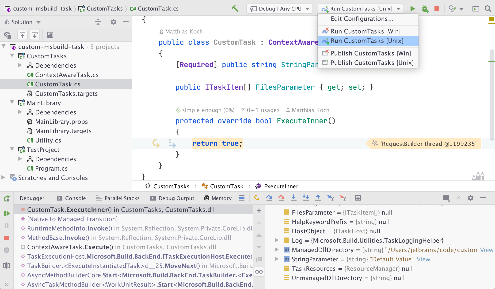

# Sample for Custom MSBuild Tasks

Run Configurations for [JetBrains Rider](https://jetbrains.com/rider) are included and allow seamless debugging:

⚠️ Note that the [specific SDK](https://dotnet.microsoft.com/download/dotnet-core/3.1#3.1.6) according to the [`global.json` file](https://github.com/matkoch/custom-msbuild-task/blob/master/global.json#L3) must be installed. The best way is to use the [InstallSdkGlobalTool](https://www.nuget.org/packages/InstallSdkGlobalTool/) and call `dotnet-install-sdk` inside the repository.
